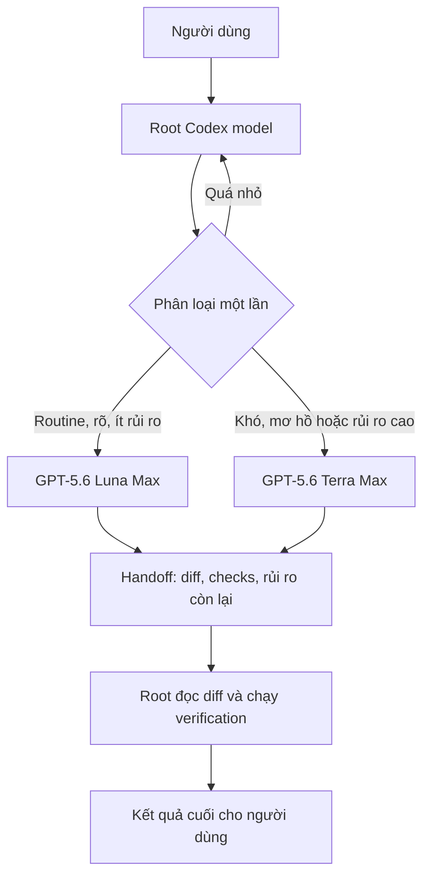
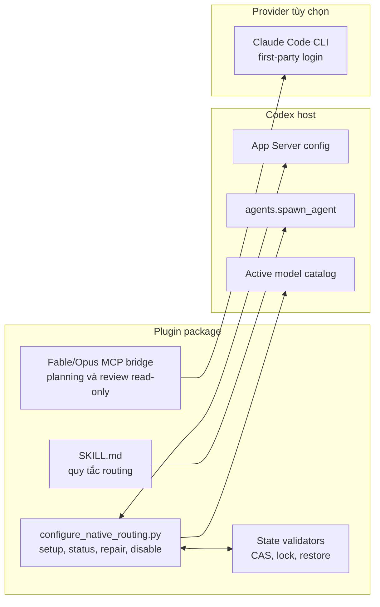
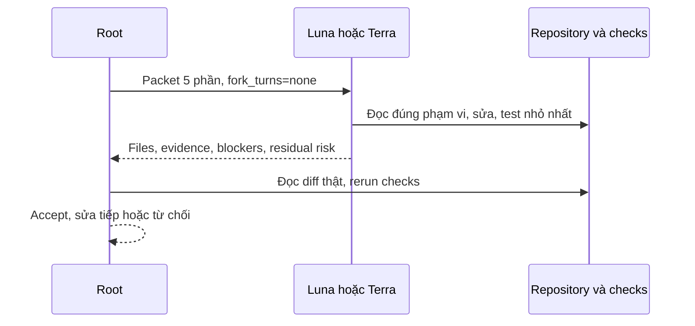
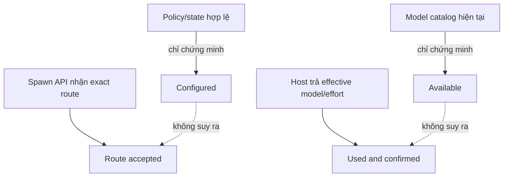

# Kiến trúc

## Tổng quan

Root là model đang điều khiển task. Plugin chỉ thêm policy và công cụ để Root có
thể chọn một worker phù hợp; nó không tạo orchestrator thứ hai.



Nếu Luna phát hiện rủi ro ẩn, Luna dừng trước khi mở rộng scope. Root cập nhật
packet và có thể thử Terra đúng một lần; không chạy hai lane cạnh tranh.

## Thành phần



- `SKILL.md` định nghĩa classification, handoff và evidence language.
- Native configurator dùng App Server `config/read` và `config/batchWrite`; không
  sửa TOML một cách mù quáng.
- State lưu exact restore values. Config/state ghi với compare-and-swap và lock;
  ambiguity hoặc concurrent change làm operation fail closed.
- Fable/Opus bridge không có tools, không giữ session, pin model/effort và kiểm
  tra structured output. Đây không phải implementation lane.
- Kimi/OpenRouter và generic External Model lifecycle không còn trong package.

## Luồng handoff

Mọi different-model child dùng `fork_turns=none` và nhận đúng năm phần:

```text
OBJECTIVE
OWNERSHIP
CONTRACTS
DONE WHEN
VERIFY AND RETURN
```

Packet mặc định dưới 1.200 từ. Worker tự đọc file cần thiết trong repository thay
vì nhận lại toàn bộ transcript, plan và log từ Root.



## Planner và Advisor tùy chọn

Planner/Advisor được cấu hình không có nghĩa là tự chạy. Chúng chỉ được gọi khi:

- người dùng yêu cầu planning/review trong task hiện tại; hoặc
- repository/risk gate bắt buộc independent review.

Routine mặc định dùng 0 call; mọi task có budget tối đa một Planner-or-Advisor
model call. Nếu repository bắt buộc exact final-tree review, Root giữ lượt đó
tới sau implementation/checks. Finding hoặc `PLAN_REVISE` không tự cho phép gọi
lần hai; Root sửa cục bộ và phải hỏi người dùng trước khi model re-review. Chỉ
current-task instruction rõ ràng mới được nới budget này.

Fable có thể là Planner qua sealed Claude bridge. Sol có thể là Advisor cùng
provider qua direct child route. Hai seat không trực tiếp nói chuyện với nhau;
Root giữ canonical plan và findings ledger.

## Ranh giới tin cậy



Không được dùng prose của child để chứng minh model identity. Policy là
model-visible instruction, không phải engine-enforced scheduler. Permission,
sandbox, approval và Goal vẫn thuộc Codex host và Root.
