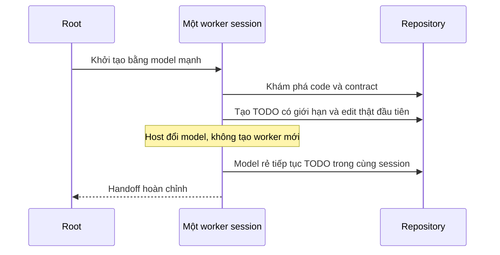
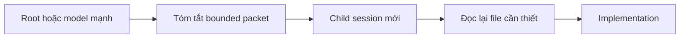

# Same-session prewalk

## Định nghĩa chính xác

Same-session prewalk là việc một model mạnh bắt đầu công việc trong chính session
của worker: khám phá repository, chốt TODO có giới hạn và thực hiện edit thật đầu
tiên. Sau đó host đổi model của cùng session để model rẻ hơn tiếp tục từ trạng thái
đã có.

Điểm quyết định không phải prompt “hãy tưởng tượng bạn là agent cũ”, mà là host
thật sự giữ session state và đổi model tại đúng chỗ.

## Cold handoff của plugin hiện tại

Codex task-local routing hiện tạo child mới khi đổi model. Plugin giảm chi phí
handoff bằng packet năm phần và `fork_turns=none`, nhưng đây vẫn là cold handoff:

Child mới không kế thừa KV cache của model khác và phải tự đọc các file cần thiết.
Packet tốt giữ trajectory và contract, không biến hai session thành một.

## Vì sao không giả lập prewalk bằng prompt

Prompt “Continue” có thể làm worker hành xử như đang tiếp tục, nhưng không chứng
minh các thuộc tính sau:

- cùng session identifier;
- cùng tool/worktree state do host quản lý;
- message history không bị serialize rồi nhập lại;
- KV cache được tái sử dụng qua model family;
- edit đầu tiên thật sự thuộc cùng worker trước và sau model switch.

Vì vậy 0.10.0 dùng tên “bounded cold handoff” và không quảng bá prewalk thật.

## Điều kiện để bổ sung prewalk trong tương lai

Chỉ nên thêm khi Codex host expose primitive đổi model trên cùng worker session.
Qualification cần chứng minh:

1. session/worktree identity giữ nguyên trước và sau switch;
2. model mạnh đã đọc contract, tạo bounded TODO và có ít nhất một edit thật;
3. model sau tiếp tục TODO, không phải nhận một transcript được đóng gói lại;
4. cancellation, permission và ownership không bị nới;
5. runtime metadata xác nhận model trước/sau;
6. benchmark đo credits, latency, pass rate và rework trên cùng task set.

## Nguồn tham khảo

- [Prewalk — Stencil](https://stencil.so/blog/prewalk): mô tả pattern mạnh trước,
  rẻ sau trong cùng trajectory và số đo benchmark của tác giả.
- [Elves — How it works](https://aigorahub.github.io/elves/#how-it-works): workflow
  delegation và biến thể tiếp tục session/worktree.
- [oh-my-pi](https://github.com/can1357/oh-my-pi): implementation tham khảo cho
  việc giữ message/session state khi đổi model.

Các nguồn trên là ý tưởng và bằng chứng của project riêng; chúng không tự chứng
minh Codex Desktop hiện có primitive tương đương.
